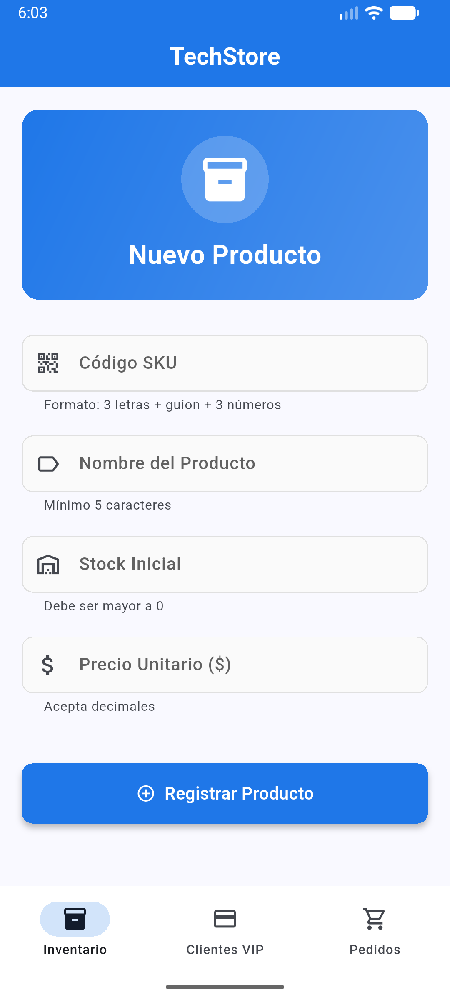

# TechStore - Sistema de Gestión de Ventas

## 📱 Descripción del Proyecto

**TechStore** es una aplicación móvil Flutter desarrollada como sistema de control interno para la empresa de tecnología con el mismo nombre. La aplicación implementa tres módulos independientes para la gestión integral de inventario, clientes VIP y pedidos, con énfasis en validaciones rigurosas y arquitectura limpia.

## 🚀 Cómo Ejecutar

### Requisitos

- Flutter 3.10.7 o superior
- Dart SDK incluido en Flutter

### Instalación y Ejecución

```bash
# Clonar el repositorio
git clone https://github.com/stefacm/tech_store.git
cd tech_store

# Descargar dependencias
flutter pub get

# Ejecutar en dispositivo/emulador
flutter run

# Ejecutar en modo debug
flutter run -d chrome  # Para web
```

## 📸 Capturas de Pantalla

### Pantalla 1: Registro de Inventario

- Formulario con validación de SKU en tiempo real
- Alerta de producto de Alta Gama al superar $1,000,000



### Pantalla 2: Clientes VIP

- Detección y visualización de franquicia de tarjeta
- Formato automático del número de tarjeta
- Validación de correo corporativo


### Pantalla 3: Gestión de Pedidos

- Calendar picker con bloqueo de fines de semana
- Validación de códigos de descuento
- Feedback visual de fechas válidas


## 👨‍💻 Autor

Desarrollado como proyecto evaluativo del taller: **"Formularios, Validaciones Avanzadas y Expresiones Regulares en Flutter"**
